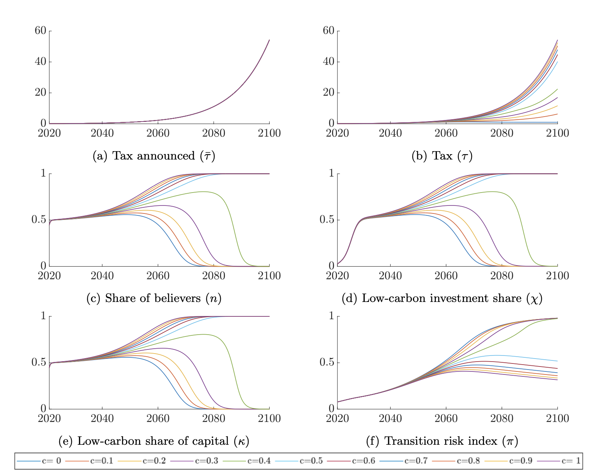

# Believe me when I say green - Replication kit 
> This repository contains model's code and replication materials for the paper "Believe me when I say green! Heterogeneous expectations and climate policy uncertainty" by Campiglio, Lamperti and Terranova.

## Table of contents
* [General Info](#general-information)
* [Programming Language](#programming-language)
* [Usage](#usage)
* [Contact](#contact)
* [License](#license)

## General Information
Here we provide the full code of the dynamic investment model with heterogenous expectations and climate policy uncertainty developed in Campiglio et al. (2023). Further, we provide pieces of code to replicate figures from the paper.

## Programming Language
Matlab/Octave

## Usage

1. Dowload all files
2. To view the model code: open the file "model_function.m" 
3. To run the model: use open the file "run.m" and run it
4. To plot results and replicate the figures of the paper: open the files in the "Figures code" folder and run them

## Contact
For any issues, suggestions and additional information free to contact: [Roberta Terranova](https://www.eiee.org/member/roberta-terranova/)

## License
TBD
